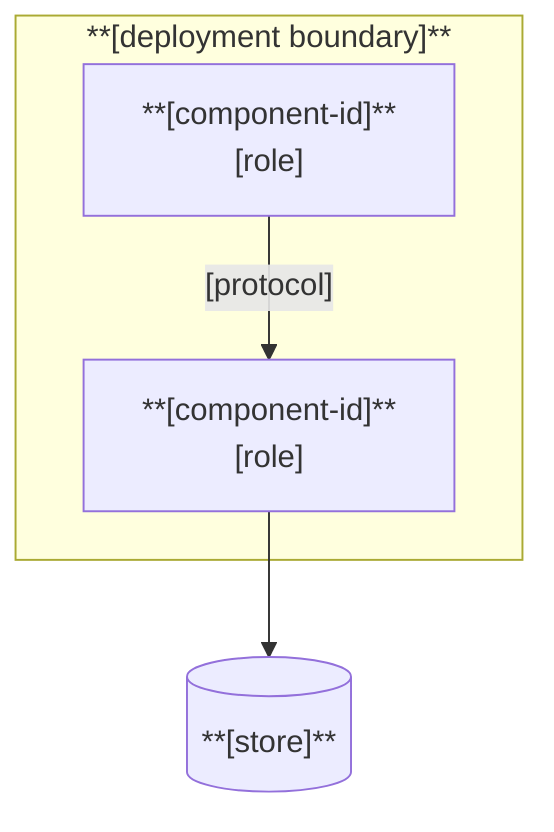
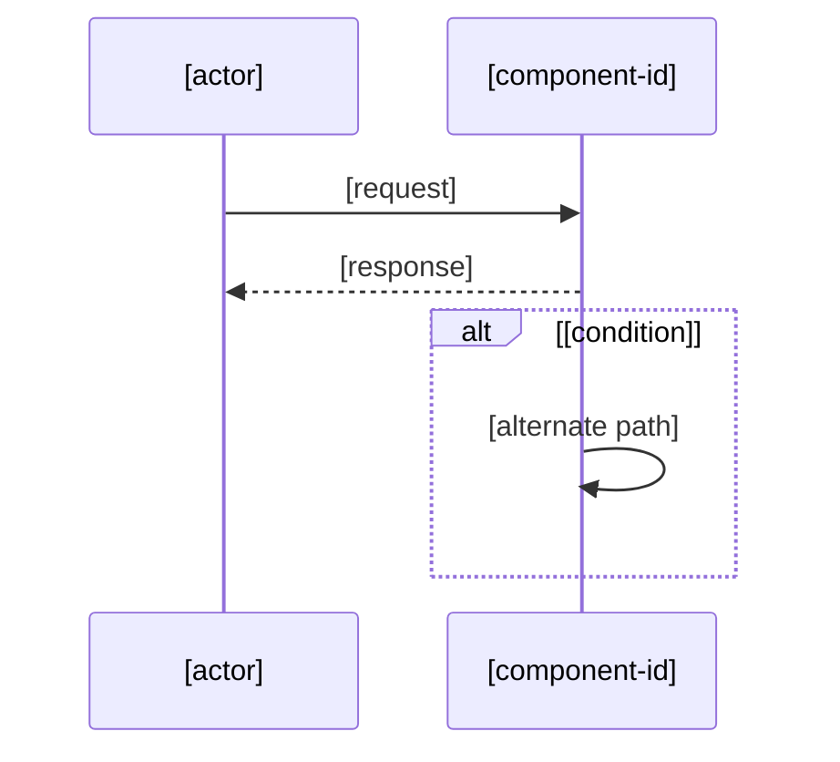
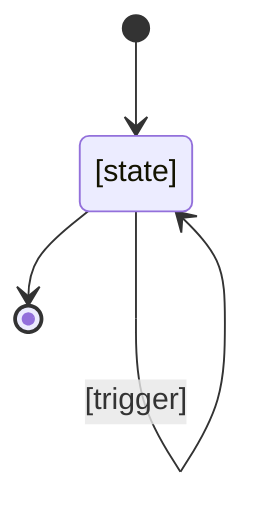
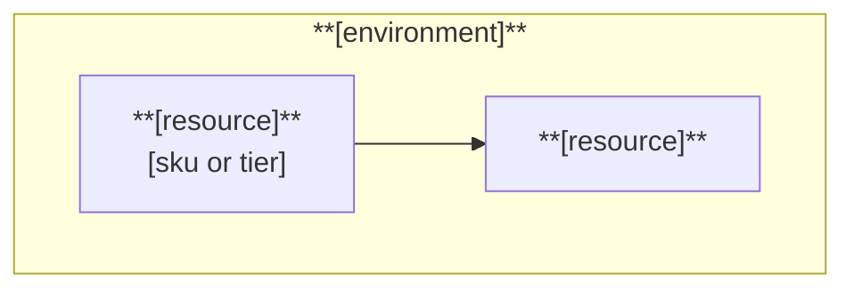
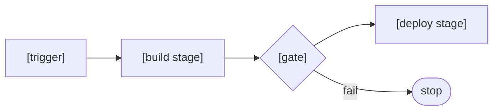

# Mermaid diagram patterns

**Audience**: agent. Use ONLY these shapes. Every element MUST trace to a dossier record.

## When a diagram is warranted

| Warranted | Not warranted |
|---|---|
| more than three interacting parts | two parts — use prose |
| a sequence with branches | a linear two-step flow |
| a topology or a state machine | a list that happens to be ordered |

## System context — Architecture

```mermaid
flowchart LR
    Actor([**[actor]**]) --> Sys[**[system]**]
    Sys --> Ext[(**[external dependency]**)]
```

## Container topology — Architecture



## Sequence — Use Cases



## State — Architecture, Reference



## Deployment — Infrastructure




## Pipeline — DevOps



## Rules

- A diagram MUST NEVER be the only carrier of a fact — accompany it with prose.
- A diagram MUST NEVER introduce a component, boundary or flow no dossier record establishes.
- Node labels MUST use the component `id` from the registry, not an invented name.
- NEVER use a real external product, customer or environment name from outside the documented repository.
## References

- **📖** `.copilot/context/10.00-application-development/07-documentation-authoring-criteria.md` — diagram policy
- **📖** `.copilot/context/10.00-application-development/01-discovery-model.md` — component ids

<!--
---
template_metadata:
  version: "1.0.0"
  last_updated: "2026-08-16"
  created: "2026-08-16"
  consumers: ["ad-documentation-author", "01.02-ad-docs-write"]
  changes: ["v1.0.0: Initial creation"]
---
-->
