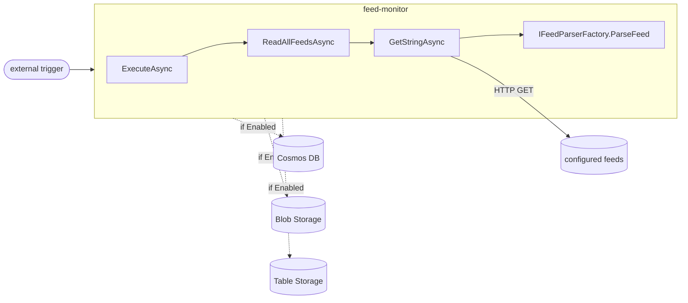
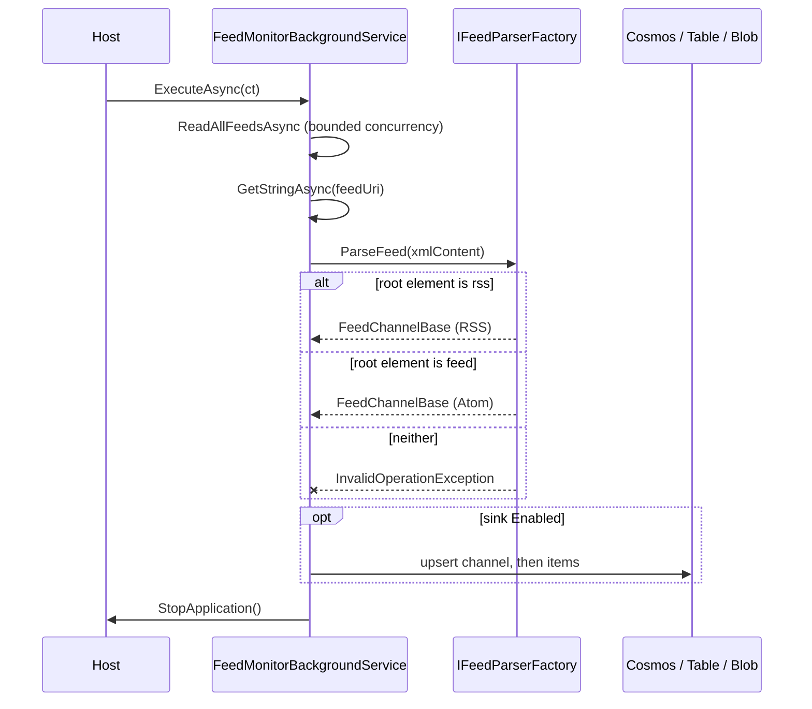

# feed-monitor — architecture

## 📑 Contents

- [Purpose and context](#-purpose-and-context)
- [Structure](#-structure)
- [Key flows](#-key-flows)
- [Dependencies](#-dependencies)
- [Design decisions](#-design-decisions)
- [Physical placement](#-physical-placement)
- [Not established](#-not-established)

## 🎯 Purpose and context

`feed-monitor` is a **job**, not a service. It starts ^[code-08], makes one pass over the feeds named in its configuration ^[code-09], writes what it found to up to three storage sinks ^[code-46], and then stops itself ^[code-10].

The host is a generic host rather than a web host ^[code-01], and no project in this repository declares a reference to it ^[code-45]. Nothing calls it; it only calls out.

Nothing inside the component decides *when* it runs. Scheduling is external to it, which is what makes it a job rather than a daemon. ^[code-12]

## 🧱 Structure

| Part | Responsibility | Established by |
|---|---|---|
| `Program.cs` | Composition root — builds the generic host, registers the single hosted service, and binds six named options instances | ^[code-01,code-02,code-07] |
| `FeedMonitorBackgroundService` | The whole run: fetch, parse, and write to every enabled sink | ^[code-08,code-09,code-42,code-43,code-46,code-22,code-23,code-24,code-25] |
| `IFeedParserFactory` | Chooses a parser for a document and returns the parsed channel | ^[code-13,code-41] |
| `RSSFeedParser`, `AtomFeedParser` | The two format implementations, both over `FeedParserBase` | ^[code-14] |
| `Models/` | The domain shape — `FeedChannelBase` and `FeedItemBase` over a shared `EntityBase` | ^[code-18,code-19] |
| `Configuration/` | The options model — one class per client, plus the component's own configuration | ^[code-07] |
| JSON converters | Carry the model's polymorphism across the persistence boundary | ^[code-20] |

The orchestrator is the structural centre of gravity: the fetch ^[code-42], the parser invocation ^[code-43] and all four sink write operations across the three sinks ^[code-22,code-23,code-24,code-25] are reached from one class.

## 🔀 Key flows

The run branches on two independent decisions — which parser handles a document, and which sinks are enabled — so both are shown.

Parser selection is **content-based**: `GetParser(XDocument)` resolves a parser by root element — `rss` selects the RSS parser ^[code-37], `feed` selects the Atom parser ^[code-38] — and `ParseFeed(string)` returns the channel that parser produces ^[code-41]. The two predicates are mutually exclusive, so the RSS-before-Atom evaluation order ^[code-16] never actually decides anything ^[code-39]. A document matching neither throws rather than being skipped ^[code-40].

Each sink is written **only when its own `Enabled` flag is set** ^[code-46], so a run may legitimately write to one, two, three or none of them.

## 🔗 Dependencies

| Depends on | Direction | Protocol | Established by |
|---|---|---|---|
| Configured feed endpoints | outbound | HTTP `GET` | ^[code-42] |
| Cosmos DB | outbound | Cosmos SDK client | ^[code-22,code-23,code-28] |
| Blob Storage | outbound | *not established* | ^[code-25] |
| Table Storage | outbound | *not established* | ^[code-24] |
| Telemetry backend | outbound | *not established* | ^[code-04] |

Three protocol values are left open deliberately. The records establish **which** sinks are written and **that** telemetry is emitted; none of them establishes the wire protocol or the export path, and `code.md` marks the roles that would settle it as deferred.

There is **no inbound dependency**, established positively: no `.csproj` under `src/` outside the component declares a reference to it. ^[code-45]

## 🧭 Design decisions

| Decision | Evidenced by | Consequence |
|---|---|---|
| One pass, then self-terminate | ^[code-10] | The job is restartable and schedulable, but carries no in-process state between runs |
| Content-based parser selection on the root element | ^[code-37,code-38] | A new format is added by adding a parser, without touching configuration |
| An unrecognised document throws rather than being skipped | ^[code-40] | One malformed feed fails loudly instead of silently producing nothing |
| Persistence key lives on the domain object | ^[code-21] | Key derivation is decided before the sink, so every sink sees the same key |
| Six **named** options instances rather than one tree | ^[code-07] | Each client is configured and reasoned about independently |
| Each sink is independently switchable | ^[code-46] | A sink can be turned off without code change — and all three can be off, producing a run that writes nothing |
| Time is injected via `TimeProvider` | ^[code-03] | Time-dependent behaviour is substitutable — though no test exercises it ^[code-gap-08] |
| Bounded concurrency through `IParallelService` | ^[code-06,code-09] | Fan-out is capped rather than unbounded |
| Fan-out to three sinks in one pass | ^[code-26] | The sinks are not transactional with one another; a partial run leaves them divergent |

Cosmos client construction accepts three authentication shapes — a connection string, an endpoint plus key, and a token credential — so the component can run with or without a secret. ^[code-28]

**The registered `HttpClient` is not the one that runs.** `Program.cs` registers a client with a `BodyLoggingHandler` ^[code-05], but the fetch constructs `new HttpClient()` directly, so neither that handler nor the factory's lifetime management applies to it. ^[code-44]

## 🏗️ Physical placement

Where this component runs is **not established by this page's evidence**. The `deployment-descriptor`, `pipeline-definition` and `infrastructure-definition` source-set roles are deferred to the `environment` and `devops` dossiers, neither of which has been produced yet.

Once the **Infrastructure** and **DevOps** chapters exist, this section will link to them rather than restate their content.

## 🕳️ Not established

> **Not established**: what triggers the run, and on what schedule. Nothing in the component schedules itself ^[code-12], and no job settings file was located. ^[code-gap-07]

> **Not established**: where this component is deployed. Sought in this page's cited dossier, whose coverage marks every deployment and infrastructure role as deferred. See § Physical placement. ^[gap]

> **Not established**: the shape of a stored document. The model is known ^[code-18] but the serialised form produced by the converters and the Cosmos serializer is not. ^[code-gap-02,code-gap-03]

> **Not established**: two configuration surfaces, `CustomerProvidedKeyConfiguration` and `TransferValidationConfiguration`, fall inside this page's declared `options-model` role but were not read. ^[code-gap-04]

> **Not established**: which of two line-number readings of the sink call sites is correct. The disagreement does not affect any statement on this page, which cites methods rather than lines. ^[code-47,code-gap-09]

> **Not established**: whether the compilation-excluded `Services/` and `Test/` folders hold anything. ^[code-35,code-gap-06]

**No test exists anywhere in this repository.** Every statement on this page rests on reading source, and none is corroborated by an executing test. ^[code-gap-08]

Two configured storage clients — File and Queue — are bound at startup but reached by no code path. They are recorded as configured-but-unreachable, not as dead code: their purpose was not derivable here and is escalated rather than assumed. ^[code-27]

Three helper types the component calls — `TimeSpanParser`, `CosmosDbHelper` and `DefaultCredentialProvider` — are defined outside this repository and their contracts cannot be verified from here. ^[code-gap-05]

<!--
verification_stamp:
  generated: "2026-08-16"
  verified: ""
  evidence:
    - dossier: "_evidence/feed-monitor/code.md"
      version: "1.1.0"
      observed: "2026-08-16"
  gates: ""
  open_gaps: 8
-->
