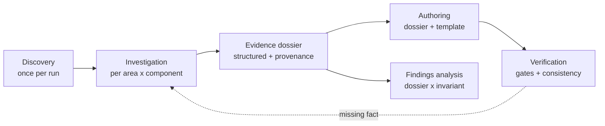

# Autonomous streams — artifact generation and update

## 📑 Table of contents

- [🎯 Goal and scope](#-goal-and-scope)
- [🧭 Decisions taken](#-decisions-taken)
- [⚠️ Pre-flight warnings](#️-pre-flight-warnings)
- [🧩 WS-A-context-domain — the shared contract](#-ws-a-context-domain--the-shared-contract)
- [📐 WS-B-instruction-file — output rules for `src/docs`](#-ws-b-instruction-file--output-rules-for-srcdocs)
- [🧱 WS-C-templates — page shapes](#-ws-c-templates--page-shapes)
- [📸 WS-D-capture-skill — live-evidence procedures](#-ws-d-capture-skill--live-evidence-procedures)
- [🤖 WS-E-agents — managers, investigators, author, verifier](#-ws-e-agents--managers-investigators-author-verifier)
- [⚙️ WS-F-prompts — elementary actions](#️-ws-f-prompts--elementary-actions)
- [🔗 WS-G-registration — wire the domain into the PE system](#-ws-g-registration--wire-the-domain-into-the-pe-system)
- [🧪 WS-H-dry-run — prove both streams on this repository](#-ws-h-dry-run--prove-both-streams-on-this-repository)
- [🔎 Discovery](#-discovery)
- [🗳️ Open decisions](#️-open-decisions)
- [🅿️ Park lot](#️-park-lot)
- [🏁 Exit criteria](#-exit-criteria)
- [📚 References](#-references)

## 🎯 Goal and scope

Create the prompt-engineering artifact set that implements **two autonomous streams**, each producing a stable, reviewable output from a repository it has not seen before:

| Stream | Input | Output |
|---|---|---|
| **Stream A — repository documentation** | repository source + live evidence | chapter pages under `src/docs/` |
| **Stream B — repository hardening** | the same evidence dossiers | findings + an actionable plan file |

Both streams run over **four separated roles**. The separation is the quality mechanism: each role fails differently, so each is governed differently.

| Role | Responsibility | May investigate? | May write output? |
|---|---|---|---|
| **Discovery** | stack profile, component registry, capability matrix | yes | registry only |
| **Investigation** | gather and record evidence for one area of one component | yes | dossier only |
| **Authoring** | render a dossier plus a template into a page | **no** | pages only |
| **Verification** | run gates over pages and across the touched set | re-read only | corrections only |

The streams are **independent** (either can run first), **convergent** (re-running updates rather than duplicates), and **shared** — Stream B consumes the same dossiers Stream A does, so the two can never disagree about what the repository contains.

### How the streams are driven

One `@mention` per intent. The manager resolves the mode, expands the scope and runs the loop — the user never orchestrates roles by hand.

| Intent | Invocation | What the manager does |
|---|---|---|
| Document a repository from scratch | `@ad-documentation-manager document this repository` | discovery → **registry checkpoint** → for each component × chapter in priority order: investigate → write → verify → **chapter checkpoint** |
| Refresh the whole documentation set | `@ad-documentation-manager refresh the documentation` | re-run discovery → diff against verification stamps → re-investigate only stale areas → rewrite only pages whose evidence moved |
| Update from a change set or a pull request | `@ad-documentation-manager update the docs for this PR` (or a commit, range, or the working tree) | resolve the change set → dimension sweep → **announce the change-set-to-page mapping** → write only the mapped pages → cross-page review |
| Find and plan robustness work | `@ad-robustness-manager scan this repository` | ensure a registry → request the dossiers → scan each component × invariant class → emit a plan file |

The seven prompts are the escape hatches for when a full run is not wanted — refresh one dossier, rewrite one page, verify one folder. They are the same units the manager loops over, so a hand-run page and a manager-run page are byte-identical.

**In scope** — 47 artifacts under the existing domain `10.00-application-development`:

| Artifact type | Count | Location |
|---|---|---|
| Context files | 12 | `.copilot/context/10.00-application-development/` |
| Instruction file | 1 | `.github/instructions/` |
| Templates | 15 | `.github/templates/10.00-application-development/` |
| Skill | 1 | `.github/skills/evidence-capture/` |
| Agent files | 11 | `.github/agents/10.00-application-development/` |
| Prompt files | 7 | `.github/prompts/10.00-application-development/` |

**Explicit non-goals** — this plan creates the capability, it does not run it to completion. Producing the full documentation set for this repository is `WS-H-dry-run`, deliberately limited to one component and one chapter per stream.

## 🧭 Decisions taken

`D3` … `D7` and `D9` survive the 2026-08-16 design review unchanged. `D1`, `D2` and `D8` were re-opened by it and are restated below in their resolved form. `D10` … `D14` are new. All are closed — re-opening any of them drops this plan back to `status: draft`.

**`D1-four-roles`** — each stream separates **discovery**, **investigation**, **authoring** and **verification** into distinct agents rather than phases inside one agent. *Superseded rationale:* one agent per stream, to keep the system small. *Why it was wrong:* the constraint was corrected to *"simplicity shouldn't come at a cost on the output accuracy"*, and the investigation surfaces are heterogeneous — source, schemas, configuration, live environments, API explorers, cloud and CI portals — each needing a different point of view, a different tool grant and different rules. Simplicity is preserved where it matters: **only the two managers are user-invoked**; the other nine agents are delegation targets, and every rule they share lives once in the context domain.

**`D2-domain-10-00`** — the domain is the existing `10.00-application-development`. `.github/prompts/10.00-application-development/` already exists with five prompts; `.copilot/context/`, `.github/agents/` and `.github/templates/` have **no** `10.00` folder, so all three are created at that number. *Superseded rationale:* a new `12.00-repository-streams`. *Why it was wrong:* these are application-development streams and deserve no separate taxonomy.

**`D3-shared-evidence`** — both streams read the **same** discovery artifact and the **same** evidence dossiers. This is the convergence mechanism: two streams that disagree about what the components are produce incoherent output. Evidence is gathered once and consumed twice.

**`D4-elementary-actions`** — there are three re-runnable units of work, not one: **investigate** one area × one component; **write** one page; **scan** one component × one invariant class. Whole-repository runs are loops over these, never a single monolithic pass.

**`D5-determinability-routing`** — the routing rule shared by every role:

| Condition | Route |
|---|---|
| Fact established from evidence, and the change has exactly one reasonable form | → write it |
| Fact established, but the change has more than one reasonable form | → § Open decisions, back to the user |
| Fact not established from evidence | → § Open decisions, back to the user — **never** inferred from absence of evidence |
| Fact undecidable until execution | → § Discovery with a defined negative branch |

**`D6-no-external-identifiers`** — artifacts carry **no** project, product, environment, customer or company name from any source other than the repository being documented. Illustrative examples in the artifacts themselves use generic placeholders (`ServiceA`, `WorkerB`, `payments-api`). This repository is public.

**`D7-output-lands-in-src-docs`** — Stream A writes under `src/docs/`. Chapter labels, ordering and icons come from per-folder `metadata.yml`, so **no existing folder is renamed** — `80. Usecases/` and `90. Issues/` keep their names and gain metadata.

**`D8-progressive-disclosure`** — depth lives in files loaded on demand, never in an always-resident body. Each agent body states its contract and its handoffs and stays small; area procedures, page shapes and catalogues live in context files, templates and the capture skill. *Superseded rationale:* "context-heavy, agents-thin" — directionally right but it under-scoped the volume by roughly a factor of three. *Evidence:* reference material surveyed on 2026-08-16 carries about 350 KB of agent-side guidance; inlining it into one file is what makes such an agent unmaintainable and causes copies to drift.

**`D9-scope-derivation-first`** — before recommending removal, replacement or redesign of any component, the stream MUST first derive and record that component's **purpose** in the registry. A recommendation that contradicts a component's recorded purpose is a scope error, not a finding. This rule exists because the sample-code purpose of a component was missed during an earlier manual analysis, producing a remove-it recommendation for a component that was intentionally present.

**`D10-manager-names`** — the two user-invoked agents are **`ad-documentation-manager`** and **`ad-robustness-manager`**. "Robustness" rather than "hardening" because the invariant catalogue covers correctness classes (batch limits, concurrency, determinism, configuration drift) as well as security ones, and it matches the existing `01-robustness-fixes.plan.md`. Names describe the output, not the technique.

**`D11-run-modes`** — three modes ship in the first delivery: **create**, **revise**, and **change-driven** (a working tree, a commit, a commit range or a pull request). Change-driven mode is cheap under `D1` because it only replaces **scope resolution** — investigation, authoring and verification are identical downstream — so it costs one context file and one prompt rather than a second pipeline. Targeted section republish is parked (`PL-8`).

**`D12-evidence-access-policy`** — there is **no restriction on which sources an investigator may reach**. The limits are on *how*:

| # | Rule |
|---|---|
| 1 | Access happens only through grants the user already holds — the stream never provisions, escalates or requests new permissions |
| 2 | Access is **non-destructive**, read-only wherever the source supports it |
| 3 | **Lower environments are preferred**; production access is discouraged and, where unavoidable, announced before it happens |
| 4 | Among lower environments, prefer the one with **better data** — typically stage over test |
| 5 | Sensitive material never reaches a published page. Where it is genuinely needed — for example security-issue detail — it goes to a sibling `*.internal.md` file that is excluded from navigation and never linked from a published page |
| 6 | Every fact obtained from a live source carries a provenance record: source, environment, timestamp |

**`D13-templates-are-required`** — every page shape has a template, and the author renders into it. Without templates the same chapter differs per component and per run, which defeats convergence. Fifteen templates are in scope; the shape count comes from the distinct page structures in `04-documentation-structure.md`, not from the chapter count.

**`D14-authors-do-not-investigate`** — the authoring role may not read source, query a database or open a portal. If a required fact is absent from the dossier, authoring **stops** and returns the gap to investigation. This is the single rule that prevents a writer inventing content to fill a template, and it is enforced by the author agent's tool grant, not only by prose.

## ⚠️ Pre-flight warnings

Read before executing any step.

- The PE system already holds **58 agent files, 100 prompt files, 19 instruction files and 65 context files**. Every new file name in this plan was verified free at authoring time; re-verify if execution is delayed.
- `.github/prompts/10.00-application-development/` **already exists** and holds five prompts. The seven prompts in `WS-F-prompts` are added alongside them — nothing there is renamed or removed. `.copilot/context/`, `.github/agents/` and `.github/templates/` have **no** `10.00` folder; all three are created.
- `pe-common.instructions.md`, `pe-agents.instructions.md`, `pe-prompts.instructions.md`, `pe-context-files.instructions.md`, `pe-instruction-files.instructions.md`, `pe-templates.instructions.md` and `pe-skills.instructions.md` **auto-apply** to the files created here. Each new artifact must satisfy its type's frontmatter schema and required-section rules — they are not optional.
- `article-writing.instructions.md` and `documentation.instructions.md` apply to `src/docs/**/*.md`. Stream A's *output* must satisfy them, so `07-documentation-authoring-criteria.md` must not contradict them — it references them.
- `.copilot/context/00.00-context-folder-index.md` and `00.00-prompt-engineering/00.02-capability-map.md` are registries. A new domain that is not registered there is invisible to the PE tooling.
- There is an existing `01.00-article-writing/documentation-{builder,researcher,validator}` triad. It governs **article authoring style**. `ad-documentation-manager` and `ad-documentation-author` govern **repository-derived documentation** and must say so in their descriptions, or agent selection becomes ambiguous.
- Eleven agents is a large addition to the `@mention` list. Only `ad-documentation-manager` and `ad-robustness-manager` may present themselves as user entry points; the other nine must state in their description that they are **delegation targets**, so they do not compete for selection.

## 🧩 WS-A-context-domain — the shared contract (🟢 done)

Create `.copilot/context/10.00-application-development/` with twelve files. Each carries the domain frontmatter required by `pe-context-files.instructions.md`. Every rule that more than one role obeys lives here and nowhere else.

### Step A1 — `00-stream-contract.md` (🟢 done)

The contract every role obeys. Contents:

- Definition of a stream: input, output, elementary actions, convergence property.
- The `D5-determinability-routing` table, verbatim, as the shared routing rule.
- The four roles from § Goal and scope, with the **may-investigate / may-write** matrix stated as a hard boundary (`D14`).
- **Idempotency rule** — a second run over unchanged evidence produces no diff. State how: every generated page carries a verification stamp, and the stream compares evidence state against it before rewriting.
- **Unverifiable-assertion protocol** — never assert from absence of evidence; mark the gap, ask, then write. Absence of a test folder means "no test project was found", never "the component is untested by design".
- **Escalation format** — the exact shape of an item routed back to the user: what is unknown, what evidence was attempted, which outputs are gated on it.
- `D9-scope-derivation-first`, stated as a hard precondition on any removal/replacement recommendation.

### Step A2 — `01-discovery-model.md` (🟢 done)

The shared discovery artifact every role consumes. Contents:

- **Stack profile** — the set of facts discovered (not assumed) about the repository: languages, target frameworks, build entry points, package/lock strategy, test surface, deployment targets, configuration mechanism. Every later rule resolves against this profile rather than hard-coding a stack.
- **Capability matrix** — which live evidence surfaces this repository actually exposes: running application, API explorer, cloud portal, CI portal, database. Discovered, never assumed. Drives which investigators have work to do.
- **Component registry** — one row per component: id, path, purpose, priority, dependencies. Priority drives both placement and processing order:

  | Priority | Meaning |
  |---|---|
  | 🔴 Core | the repository's reason to exist |
  | 🟠 Supporting | required for Core to function |
  | 🟡 Tooling | build, test, automation |
  | ⚪ Peripheral | samples, scratch, experiments |

- **Layout mode** — single-component when exactly one component is Core with no Supporting, multi-component otherwise. Chapters are identical in both; only the component pivot below a chapter changes.
- **Purpose derivation** — how purpose is established: entry-point analysis, configuration defaults, deployment descriptors, sibling README claims, explicit in-code markers. Record the evidence, not just the conclusion. A component whose purpose cannot be derived is escalated, never guessed.
- **Persistence and staleness** — where the profile and registry are written so every role and later run reads the same thing, and how a stale registry is detected.

### Step A3 — `02-evidence-dossier-schema.md` (🟢 done)

The keystone artifact: the handoff contract between investigation and authoring. Get this wrong and the role separation buys nothing. Contents:

- **Location and lifecycle** — dossiers live at `src/docs/_evidence/{component}/{area}.md` with `publish: false`, are regenerated rather than edited, and are the only thing an author may read.
- **Record shape** — every recorded fact carries: the assertion, the evidence location, the evidence kind (source / configuration / schema / live observation / capture), the environment it came from where applicable, a timestamp, and a confidence marker.
- **Gap records** — a fact that was sought and not found is recorded explicitly as a gap with what was attempted. An empty dossier section and a dossier section with no gaps must be distinguishable.
- **Coverage declaration** — each dossier states which questions its area is responsible for answering, so the verifier can detect a dossier that is silently incomplete.
- **Sensitive-material split** — how a fact classified sensitive under `D12` is routed to the `*.internal.md` side rather than the published side, and how the published side references its existence without disclosing it.

### Step A4 — `03-evidence-access-policy.md` (🟢 done)

`D12`, expanded into operating rules. Contents:

- The six access rules from `D12`, each with what compliance looks like in practice.
- **Environment preference order** — the ranking rule (better data first, production last) and how an investigator establishes which environments exist without assuming a naming convention.
- **Production announcement protocol** — what must be stated to the user before any production-touching read, and what makes such a read refusable.
- **Read-only enforcement** — per source kind, which operations are permitted; for databases specifically, schema and shape inspection rather than bulk extraction.
- **Sensitive-material classification** — the test that decides published page versus `*.internal.md`: credentials and secrets, personal data, exploit-enabling detail, and internal-only endpoints or hostnames.
- **Provenance record** — the exact form of the source/environment/timestamp stamp that every live-sourced fact carries.

### Step A5 — `04-documentation-structure.md` (🟢 done)

The canonical chapter set, placement rules and page shapes. Contents:

- The eleven chapters, fixed and always present: Home, Getting Started, Architecture, Use Cases, Infrastructure, Reference, Other Components, Validation, Security, DevOps, Appendix.
- **Component pivot** — below a chapter, subfolders are component-pivoted when two or more components are relevant to it, flat otherwise.
- **Page-shape catalogue** — the distinct page structures that `WS-C-templates` implements, and which chapter uses which. This is the authority that decides the template count.
- **Major versus minor placement** — Core and Supporting components are documented in the main chapters only; Tooling and Peripheral components are the entire content of *Other Components* and the Appendix. A major component with a page under *Other Components* is a defect.
- **Mapping onto existing folders** — chapters are realised through per-folder `metadata.yml` (`label`, `order`, `icon`, `hidden`), so existing folders keep their names. Include the mapping for this repository's current tree as a worked example.
- **Placement rule** — given a component and a fact, exactly one chapter is correct. State the tie-breakers so two runs place the same fact identically.

### Step A6 — `05-source-sets-and-propagation.md` (🟢 done)

The convergence engine. Contents:

- **Source set** — every generated page declares its authoritative inputs as *stack-agnostic roles* ("composition root", "options classes", "deployment descriptor"), never as a hard-coded path list. The role resolves to concrete paths through the stack profile.
- **Investigator ownership** — which of the six investigators owns each role, so no source set is unowned and none is claimed twice.
- **Traceability anchors** — the inline marker format that ties an assertion on a page back to its dossier record.
- **Verification stamp** — the per-page record of what was verified and against which evidence state, enabling delta detection instead of blind regeneration.
- **Impact propagation map** — changed source role → the set of pages that must be re-verified. This is what makes an update run cheap and complete at the same time.

### Step A7 — `06-change-impact-assessment.md` (🟢 done)

Change-driven mode (`D11`). Contents:

- **Change-set resolution** — how a scope is derived, read-only, from each supported input: working tree, a single commit, a commit range, a commit list, a pull request. Record the resolved file list and hunks as the change set.
- **Dimension sweep** — for **every** change set, however small, assess impact across all documentation dimensions: behaviour, logical architecture, physical architecture, use cases, reference, validation, security, devops, other. Behaviour is the anchor — when it changes, every other dimension is evaluated explicitly. A dimension with no impact is recorded as *"no impact — {reason}"*, never skipped silently.
- **Mapping output** — the change-set-to-page table the manager must announce **before** any page is touched, with a Skip / Extend / Update / Create action per row.
- **Union rule** — the final scope is the union of the dimension sweep and the impact propagation map from `05-source-sets-and-propagation.md`.

### Step A8 — `07-documentation-authoring-criteria.md` (🟢 done)

How a page is written, given a dossier and a template. Contents:

- **Progressive disclosure** — current and recommended behaviour leads; legacy, edge cases and implementation notes follow. Applied at page, section and paragraph level.
- **Content preservation** — the classification model for existing content encountered during a revise run: *move* (relocate with a marker), *user-added valid detail* (preserve and reposition), *superseded* (keep below a divider, marked), *evidence-contradicted* (relocate to the appendix, marked), *ambiguous* (ask). Deleting a reader's content is never the default.
- **Handling of missing information** — the on-page representation of a known gap, so gaps are visible rather than silently absent.
- **Diagram policy** — when a diagram is required rather than optional, and the complexity ceiling.
- A pointer to `article-writing.instructions.md` and `documentation.instructions.md` as the authority for voice, formatting and reference classification. This file must not restate them.

### Step A9 — `08-verification-gates.md` (🟢 done)

What the verifier checks. Contents:

- **Per-page gates** — every assertion has a traceability anchor; the verification stamp is current; the template's required blocks are present; no assertion lacks a dossier record.
- **Cross-page lenses** — run over the whole touched set, not page by page: readability in context, message prioritisation, consistency of a repeated fact across pages, internal non-contradiction, link validity in both directions, navigation coverage.
- **Exposure gate** — no published page links to or names an `*.internal.md` file; no published page carries credentials, personal data or exploit-enabling detail.
- **Failure handling** — which failures the verifier fixes itself and which it must return to investigation or to the user.

### Step A10 — `09-hardening-invariant-catalog.md` (🟢 done)

What Stream B looks for. Organise as **invariant classes**, each with: the invariant, how it is checked against a dossier, what a violation looks like, and its default severity.

| Class | Example invariants |
|---|---|
| **Identity and keys** | every persisted entity has a deterministic, non-random key; keys satisfy the target store's character rules |
| **Batch and quota limits** | batched operations respect documented per-request caps; batch results are inspected, not assumed |
| **Concurrency** | shared counters and collections written from parallel paths are safe; per-item failure does not abort the batch |
| **Secret exposure** | configuration objects carrying secrets are never serialised into logs, traces or telemetry |
| **Injection** | values originating outside the process are never interpolated into a query, filter or path |
| **Deserialisation** | polymorphic deserialisation is constrained to a known type set |
| **Outbound calls** | every outbound call carries a cancellation token, a timeout, a response size bound and a scheme allow-list |
| **Determinism** | values used to build a persisted path or key are stable across processes |
| **Configuration drift** | declared configuration is consumed; consumed configuration is declared; documentation matches both |

The catalog is stack-agnostic: each invariant states the *property*, and the check resolves against the stack profile.

### Step A11 — `10-hardening-tiering-and-routing.md` (🟢 done)

What Stream B does with a finding. Contents:

- **Severity tiers** and the promotion rule between them: 🔴 correctness and security → current plan; 🟠 resilience → sibling plan; 🟡 hygiene → park lot.
- **Finding record shape** — invariant, component, dossier record, observed behaviour, expected behaviour, severity, proposed remediation. Implemented by `finding-record.template.md`.
- **Plan handoff** — how a set of findings becomes a plan file that satisfies `plan-execution.instructions.md`: findings become workstreams, and the routing rule from `00-stream-contract.md` decides what becomes a step versus an open decision versus a parked item.
- **The scope guard** — restate `D9-scope-derivation-first` at the point of use: a finding that recommends removing a component is invalid unless the component's recorded purpose supports removal.

### Step A12 — `11-run-model.md` (🟢 done)

How a manager turns one instruction into a completed run. Without this the artifact set is a toolkit rather than a capability. Contents:

- **Mode recognition** — the vocabulary that selects create, revise or change-driven, and the tie-break when an instruction is ambiguous: state the inferred mode and proceed, never ask twice for the same run.
- **Scope expansion per mode**, matching the table in § Goal and scope.
- **Checkpoints** — the fixed points where a run pauses for the user, and what is shown at each:

  | Checkpoint | Shown | Why it is mandatory |
  |---|---|---|
  | After discovery | the component registry with derived purposes and priorities | everything downstream is placed by priority; a wrong registry corrupts the whole run |
  | After the change-set mapping | the change-set-to-page table with every dimension accounted for | the user must see what will and will not be touched before anything is written |
  | After each chapter | pages written, gaps raised, gates that failed | a long run must be steerable, not all-or-nothing |
  | Before any production-touching read | the source, the environment and the reason | required by `03-evidence-access-policy.md` |

- **Run state and resumability** — a run record naming the mode, the resolved scope, the completed units and the open gaps, persisted so an interrupted run resumes instead of restarting. State where it is written and how a stale record is detected.
- **Processing order** — components in registry priority order, chapters in the fixed chapter order, so two runs over the same repository produce the same sequence.
- **Breadth control** — how the user narrows a run to a component, a chapter, or the Core tier, and what the manager reports about what it deliberately did not touch.
- **Termination and reporting** — what a completed run outputs: pages touched, gaps still open, gates failed, and the next runnable unit.

## 📐 WS-B-instruction-file — output rules for `src/docs` (🟢 done)

### Step B1 — Create `.github/instructions/repository-docs.instructions.md` (🟢 done)

`applyTo: 'src/docs/**'`. This file carries only what must fire automatically when a repository-documentation page or an evidence dossier is edited:

- the verification stamp and source-set blocks are mandatory and must be updated in the same edit as the content;
- assertions require a traceability anchor back to a dossier record;
- an unverified assertion must be marked, never silently written;
- chapter membership is declared by the folder's `metadata.yml`, not by the file name;
- files under `_evidence/` and any `*.internal.md` carry `publish: false` and are never linked from a published page.

Everything else stays in the context domain. Keep this file short — it is injected on every edit under `src/docs/`.

Add the file to the `Rule → canonical source` table in `.github/copilot-instructions.md` so it is discoverable alongside the existing entries.

## 🧱 WS-C-templates — page shapes (🟢 done)

Fifteen templates in `.github/templates/10.00-application-development/`, per `pe-templates.instructions.md`. The author renders into these; without them the same chapter differs per component and per run (`D13`).

### Step C1 — Structural templates (🟢 done)

| Template | Purpose |
|---|---|
| `doc-documentation-structure.template.md` | the folder tree and chapter authority that `04-documentation-structure.md` points at |
| `doc-evidence-dossier.template.md` | the dossier shape from `02-evidence-dossier-schema.md` — the most consequential template here |
| `doc-mermaid-patterns.template.md` | the permitted diagram shapes and their complexity ceilings |

### Step C2 — Page templates for the dry-run chapters (🟢 done)

Authored first because `WS-H-dry-run` exercises them.

| Template | Page shape |
|---|---|
| `doc-chapter-overview.template.md` | any chapter landing page, including Home and Getting Started |
| `doc-architecture-page.template.md` | system context and logical architecture, diagram required |
| `doc-reference-entry.template.md` | one reference entry — a domain type, a configuration key set or a data table |

### Step C3 — Remaining page templates (🟢 done)

| Template | Page shape |
|---|---|
| `doc-use-case.template.md` | one actor-facing scenario: actor, trigger, preconditions, outcome, key operations, evidence |
| `doc-infrastructure-environment.template.md` | one environment: resources grouped by category, capture first |
| `doc-api-unit.template.md` | one API unit: operations, parameters, status codes, auth, capture |
| `doc-security-posture.template.md` | observable security posture, no exploit detail |
| `doc-security-control-family.template.md` | one control family, for repositories with a control catalogue |
| `doc-devops-pipeline.template.md` | one pipeline: triggers, stages, gates, capture |
| `doc-validation-unit.template.md` | validation coverage for one unit |
| `doc-component-minor.template.md` | one Tooling or Peripheral component, reduced evidence |

### Step C4 — Stream B template (🟢 done)

`finding-record.template.md` — the finding shape defined in `10-hardening-tiering-and-routing.md`.

### Step C5 — Prove template completeness (🟢 done)

Every page shape listed in `04-documentation-structure.md` has exactly one template, and every template is referenced by at least one page shape. An unreferenced template or an unshaped page is a defect to fix before `WS-H-dry-run`.

## 📸 WS-D-capture-skill — live-evidence procedures (🟢 done)

### Step D1 — Create `.github/skills/evidence-capture/SKILL.md` (🟢 done)

A skill rather than a context file because these are step-by-step procedures with a decision tree, invoked by several investigators. Per `pe-skills.instructions.md`, the description must state the trigger conditions explicitly.

Shared standards, stated once:

- **Window and framing** — an independent, undocked browser window; frame to the relevant content rather than capturing the whole page; representative data only, never test or fixture data.
- **Discovery, never hardcoding** — every URL is resolved from repository evidence or from the user, never written into the procedure.
- **Freshness check before capture** — an asset is recaptured only when it is missing, when its underlying definition changed, or when it exceeds its age floor. A current asset is kept.
- **Provenance comment** — each captured asset carries a machine-readable record of what was captured, from which environment, and when. Later runs read this to detect drift.
- **Fallback** — when a surface is unreachable or the user declines, write a marked placeholder. Silently omitting a capture is a defect.

### Step D2 — The four procedures (🟢 done)

One reference file per procedure under `.github/skills/evidence-capture/references/`:

| Procedure | Surface | Consumed by |
|---|---|---|
| API explorer | the live API-explorer UI, one unit at a time, others collapsed | `ad-code-investigator` |
| Application UI | the running application, one page per scenario | `ad-code-investigator` |
| Environment | the cloud portal, one resource group at a time | `ad-environment-investigator` |
| Pipeline | the CI portal, one pipeline's run history | `ad-devops-investigator` |

Each states: when to run, how the URL is discovered, the step sequence, the freshness rule, the asset path and naming convention, and the fallback.

### Step D3 — Bind the skill to the access policy (🟢 done)

Every procedure opens by resolving the target environment through `03-evidence-access-policy.md` — better data first, production last and announced. A procedure that names an environment directly is a defect.

## 🤖 WS-E-agents — managers, investigators, author, verifier (🟢 done)

Eleven files in `.github/agents/10.00-application-development/`, per `pe-agents.instructions.md`. Bodies stay small; depth is referenced, not inlined (`D8`).

### Step E1 — `ad-documentation-manager.agent.md` (🟢 done)

Stream A's only user entry point. Responsibilities: resolve the run mode (`D11`), resolve scope, delegate, sequence, checkpoint and report, all per `11-run-model.md`. It **does not** investigate, write pages or run gates itself.

| Mode | Scope resolution |
|---|---|
| create | the component registry, in priority order |
| revise | a user-named page, component or chapter, expanded through the impact propagation map |
| change-driven | a change set, expanded through the dimension sweep in `06-change-impact-assessment.md` |

The description must say **repository-derived documentation** explicitly, to separate it from the article-writing triad.

### Step E2 — The six investigators (🟢 done)

Shared by both streams (`D3`). Each owns a set of source-set roles, holds its own tool grant, and emits dossiers only.

| Agent | Point of view | Primary evidence |
|---|---|---|
| `ad-code-investigator.agent.md` | what the code does | source, composition root, layering, API units, tests; API-explorer and application captures |
| `ad-data-investigator.agent.md` | what is persisted | entities, schemas, migrations, read-only schema inspection of a live store |
| `ad-configuration-investigator.agent.md` | what is configurable | configuration keys, flags, per-environment overrides, secret references |
| `ad-environment-investigator.agent.md` | what is provisioned | infrastructure definitions, resource inventory, cloud-portal captures |
| `ad-devops-investigator.agent.md` | how it is built and shipped | pipeline definitions, gates, CI-portal captures |
| `ad-security-investigator.agent.md` | how it is defended | a control-oriented sweep across the other dossiers plus auth, crypto, transport and exposure evidence |

Each description must state that the agent is a **delegation target**, not a user entry point.

### Step E3 — `ad-documentation-author.agent.md` (🟢 done)

Renders one page from one dossier set plus one template. Its tool grant excludes source reading, database access and browser access — `D14` is enforced by capability, not only by prose. When a required fact is absent, it stops and returns a named gap.

### Step E4 — `ad-documentation-verifier.agent.md` (🟢 done)

Runs `08-verification-gates.md` over a touched set: per-page gates, then the cross-page lenses, then the exposure gate. Fixes what it is permitted to fix and returns the rest.

### Step E5 — `ad-robustness-manager.agent.md` (🟢 done)

Stream B's only user entry point. Ensures a registry exists — building a minimal one if Stream A has not run — requests the dossiers it needs from the same six investigators, delegates analysis, and emits the plan file. Checkpoints and run state follow `11-run-model.md`.

### Step E6 — `ad-robustness-analyst.agent.md` (🟢 done)

Matches one component's dossiers against one invariant class from `09-hardening-invariant-catalog.md` and emits findings in the `finding-record.template.md` shape, each with its dossier record. It proposes remediation; it never edits source.

### Step E7 — Cross-reference the two managers (🟢 done)

Each manager's description names the other and states the handoff: both consume the same registry and dossiers, either may run first, and whichever runs first creates what is missing. This is what makes the streams order-independent.

## ⚙️ WS-F-prompts — elementary actions (🟢 done)

Seven files added to the existing `.github/prompts/10.00-application-development/`, per `pe-prompts.instructions.md`. Each performs exactly one elementary action and is independently runnable without a manager.

| Prompt | Action |
|---|---|
| `01.00-ad-docs-discover.prompt.md` (🟢 done) | Build or refresh the stack profile, capability matrix and component registry. Idempotent. |
| `01.01-ad-docs-investigate.prompt.md` (🟢 done) | Produce or refresh **one dossier**: one area × one component. Takes component id and area. |
| `01.02-ad-docs-write.prompt.md` (🟢 done) | Render **one page** from its dossier set and template. Fails with a named gap rather than inventing. |
| `01.03-ad-docs-verify.prompt.md` (🟢 done) | Run the gates over a named page set; report failures; refresh stamps. |
| `01.04-ad-docs-update-from-changes.prompt.md` (🟢 done) | Resolve a change set, run the dimension sweep, and emit the change-set-to-page mapping. Does not write pages — it produces the scope that `01.02-ad-docs-write` consumes. |
| `02.00-ad-harden-scan.prompt.md` (🟢 done) | Scan **one component × one invariant class** against its dossiers; emit findings. |
| `02.01-ad-harden-plan.prompt.md` (🟢 done) | Convert a finding set into a plan file satisfying `plan-execution.instructions.md`. |

### Step F8 — Verify prompt independence (🟢 done)

Run each prompt in a fresh session with no prior conversation state. Where a prompt needs the registry or a dossier, it must read it from disk and fail with a named escalation if absent — it must not silently rebuild it, because a silent rebuild inside a page run is how two runs diverge. If any prompt succeeds without its input present, it is rebuilding silently: add the explicit read and the named escalation, then re-run this step.

### Step F9 — Verify prompt/agent non-duplication (🟢 done)

Every prompt delegates to the agent that owns the action rather than restating its rules. A rule that appears in both a prompt and an agent is a drift source; move it to the context domain and reference it from both.

## 🔗 WS-G-registration — wire the domain into the PE system (🟢 done)

### Step G1 — Register the context domain (🟢 done)

Add `10.00-application-development` to `.copilot/context/00.00-context-folder-index.md`, matching the entry shape used by `01.00-article-writing`.

### Step G2 — Register the capability (🟢 done)

Add the two streams to `.copilot/context/00.00-prompt-engineering/00.02-capability-map.md`. See `DSC1-capability-map-granularity` for the entry granularity.

### Step G3 — Add the domain to the PE artifact map (🟢 done)

Add a row to the **PE Artifact Map** table in `.github/copilot-instructions.md` naming the two managers and their `@mention` trigger, and stating that the remaining nine agents are delegation targets, so the streams are discoverable from the always-injected file without polluting agent selection.

### Step G4 — Register the capture skill (🟢 done)

In a fresh session, describe a capture task without naming the skill and observe whether `evidence-capture` is selected. If it is not, its `description` field does not carry the trigger vocabulary — rewrite the description with the surface names (API explorer, application UI, cloud portal, CI portal) and re-run this step. No prompt or agent may be required to name the skill for it to be found.

## 🧪 WS-H-dry-run — prove both streams on this repository (🟠 partial)

The artifacts are unproven until each role produces a real output. Keep the dry run deliberately small, but exercise **every role at least once**.

### Step H1 — Run discovery (🟢 done)

Run `01.00-ad-docs-discover` against this repository. Acceptance: the registry contains every project in `src/`, each with a derived purpose and a priority; the capability matrix records which live surfaces this repository actually exposes. The sample-code component identified during the FeedMonitor analysis must appear with its purpose recorded — this is the direct regression test for `D9-scope-derivation-first`.

### Step H2 — Produce one dossier (🟢 done)

Run `01.01-ad-docs-investigate` for the highest-priority component, area **code**. Acceptance: the dossier exists under `src/docs/_evidence/`, carries `publish: false`, every record has an evidence location and kind, and at least one gap is recorded explicitly rather than left silent.

### Step H3 — Author one page (🟢 done)

Run `01.02-ad-docs-write` for that component's **Architecture** page. Acceptance: the page satisfies `repository-docs.instructions.md`, renders the template's required blocks, and every assertion carries a traceability anchor to a dossier record.

### Step H4 — Prove the author cannot investigate (🟢 done)

Remove one required fact from the dossier and re-run `01.02-ad-docs-write`. Acceptance: it **stops with a named gap**. If it fills the gap instead, `D14` is not enforced and Step E3's tool grant must be corrected before this plan can close.

### Step H5 — Prove convergence (🟢 done)

Restore the dossier and re-run `01.02-ad-docs-write` with unchanged evidence. Acceptance: **no diff**. A diff here means the idempotency rule in `00-stream-contract.md` is not implemented and Step A1 must be corrected.

### Step H6 — Verify (🟢 done)

Run `01.03-ad-docs-verify` over the authored page. Acceptance: every gate reports explicitly — a gate that produces no output is indistinguishable from a gate that did not run, and is a defect.

### Step H7 — Prove change-driven scope resolution (🟢 done)

Run `01.04-ad-docs-update-from-changes` against the working tree. Acceptance: it emits the change-set-to-page mapping with **every** dimension listed — impacted ones with pages, unimpacted ones with a one-line reason. A silently omitted dimension is a defect.

### Step H8 — Scan one invariant class (🟢 done)

Run `02.00-ad-harden-scan` for the same component against the **Secret exposure** class. Acceptance: it independently rediscovers the configuration-serialisation exposure already recorded in `20260813.02-feedmonitor-feeds-support/01-robustness-fixes.plan.md`, citing dossier records. A stream that cannot rediscover a known finding is not yet reliable.

### Step H9 — Prove the run model end to end (🔴 blocked)

Invoke `@ad-documentation-manager` once with `document this repository`, scoped to the 🔴 Core tier. Acceptance: it reaches the registry checkpoint without being told to, runs investigate → write → verify without further instruction, and reports pages touched, gaps open and gates failed. Interrupt it mid-run and re-invoke: it must resume from the run record rather than restart. If it restarts, the run state in `11-run-model.md` is not implemented and Step A12 must be corrected.

### Step H10 — Record the outcome (🟢 done)

Append the dry-run result to `.copilot/context/00.00-prompt-engineering/05.05-practical-effectiveness-log.md`, following the existing entry shape.

## 🔎 Discovery

Items undecidable until execution. Each carries a defined negative branch.

**`DSC1-capability-map-granularity`** — **resolved 2026-08-16**: neither branch applied literally. The map indexes **per user-facing capability**, not per artifact and not per domain — its existing Category 4.4 already collapses a whole agent set into one row. Branch taken accordingly: a new **Category 6** with ten rows — the two manager entry points, the seven elementary-action commands, and the capture skill. The nine delegation-target agents get no row, because a user cannot invoke them directly and the map is a *how do I invoke this* index.

**`DSC2-agent-folder-frontmatter`** — **resolved 2026-08-16**: `.github/agents/01.00-article-writing/` holds agent files and their sibling changelogs only, with no folder-level metadata file. Negative branch taken — `10.00-application-development/` is created with agent files only.

**`DSC3-author-tool-grant`** — **resolved 2026-08-16**: the agent frontmatter `tools:` list is tool-scoped, not path-scoped, so `read_file` cannot be restricted to the dossier tree. Partial-enforcement branch taken — the author is granted `read_file` and `create_file`/`replace_string_in_file` only, and is **denied every discovery tool** (`semantic_search`, `grep_search`, `file_search`, `list_dir`, `run_in_terminal`, browser and database tools). Without discovery it cannot locate a source file to read. The path restriction is stated in prose, and Step H4 is the binding test.

**`DSC4-live-surfaces-present`** — **resolved 2026-08-16** at Step H1. Three surfaces are **present** — the running application, the API explorer (all six APIs launch `/swagger`), and the CI portal. Two are **present-but-unreachable** — the cloud portal and the database: configuration *key names* for both exist in the repository, but no address or credential does, so their existence is established while access is not. That third state was not anticipated by either branch and is now recorded in the capability matrix as its own value, because "absent" and "reachable" would both have been false claims. A sixth surface, the **test surface**, is an established absence: no test project or test framework reference exists anywhere under `src/`.

## 🗳️ Open decisions

None. `OD1` … `OD6`, raised by the 2026-08-16 design review, were closed on the same day into `D1`, `D2`, `D10`, `D11`, `D12` and `D13`.

## 🅿️ Park lot

Out of scope for this plan. Not to be executed here.

- **`PL-1-generalise-learning-hub-context`** — `.copilot/context/90.00-learning-hub/` holds site-specific rules that partially overlap the new domain. → defer
- **`PL-2-ai-content-services`** — semantic search, summarisation and Q&A over generated documentation. → defer
- **`PL-3-portability-packaging`** — a mechanism to copy domain `10.00-application-development` into another repository as a unit. The artifacts are authored to be portable; the packaging is separate. → defer
- **`PL-4-quarto-retirement`** — `_quarto.yml`, `index.qmd`, `.quartoignore` and `quarto-publish.yml` become redundant once the rendering application serves `src/docs`. → `02-smartdocs-web-convergence.plan.md`
- **`PL-5-scaffold-cleanup`** — `src/20.00 Api/SmartDocs` is an untouched `dotnet new webapi` scaffold (git-tracked, absent from the solution). → defer
- **`PL-6-stream-c-validation`** — a third stream generating executable validation from the documented behaviour. → defer
- **`PL-7-investigator-parallelism`** — running the six investigators concurrently rather than in sequence. The role split makes it possible; proving it does not corrupt shared dossier state is separate work. Revisit with evidence from `WS-H-dry-run`. → defer
- **`PL-8-targeted-section-republish`** — a fourth run mode that regenerates one chapter from a curated raw-input folder without touching the rest. Excluded from `D11` because no such raw-input folder exists in this repository yet. → defer

## 🏁 Exit criteria

- All twelve context files exist under `.copilot/context/10.00-application-development/` and satisfy `pe-context-files.instructions.md`. (🟢 done)
- `repository-docs.instructions.md` exists, applies to `src/docs/**`, and is referenced from `.github/copilot-instructions.md`. (🟢 done)
- All fifteen templates exist, each is referenced by exactly one page shape in `04-documentation-structure.md`, and no page shape is untemplated. (🟢 done)
- The `evidence-capture` skill exists with its four procedures and is discoverable by description alone. (🟢 done)
- All eleven agent files exist and satisfy `pe-agents.instructions.md`; exactly two present themselves as user entry points and nine declare themselves delegation targets. (🟢 done)
- All seven prompt files exist alongside the five already in `10.00-application-development`, satisfy `pe-prompts.instructions.md`, and each runs standalone. (🟢 done)
- The domain is registered in the context folder index, the capability map and the PE artifact map. (🟢 done)
- Discovery produced a registry covering every project in `src/`, each with a derived purpose, plus a capability matrix of the live surfaces present. (🟠 partial)
- One dossier exists with explicit gap records, and one Architecture page renders from it with every assertion anchored. (🟠 partial)
- Authoring **stops with a named gap** when a required dossier fact is removed. (🟢 done)
- Re-running authoring over unchanged evidence produces no diff. (🟢 done)
- The change-driven mode emits a mapping in which every documentation dimension is accounted for, impacted or not. (🟢 done)
- The hardening scan independently rediscovered a known finding, citing dossier records. (🟢 done)
- A single `@ad-documentation-manager` invocation completes a Core-tier run with checkpoints, and an interrupted run resumes rather than restarts. (🔴 blocked)
- No published page names or links an `*.internal.md` file, and no published page carries credentials or personal data. (🟢 done)
- No artifact contains a project, product, environment or company name originating outside this repository. (🟢 done)

### Why three criteria are not green

- **Registry — 🟠 partial.** The registry does cover all eleven projects and the capability matrix is complete, but purpose was *derived* for only five of them. The six `Smart*Api` projects are unmodified `WeatherForecast` scaffolds: all five derivation sources were consulted and none established a purpose, so they are recorded as escalations. That is `D9` behaving correctly — the alternative was to invent a purpose from the project name, which `D9` forbids. The criterion as worded ("each with a derived purpose") cannot be met by a repository containing scaffolds, so **the criterion is what needs amending, not the run**.
- **Page — 🟠 partial.** The dossier and its gap records are complete, and all 45 anchors resolve. The page is not green because its verification stamp still reads `verified: ""` — two verification rounds ran, the second closing 14 of 15 findings, but no third round ran after the last fixes. Marking the page verified without that round would be exactly the unearned claim the stamp exists to prevent.
- **Manager run — 🔴 blocked.** Not a defect in the artifacts. VS Code builds its agent registry at session start, so the eleven agents created in this session are not invocable within it. The manager's *sequence* was exercised end to end by hand (registry checkpoint → investigate → write → verify → change-driven update), but **resume-from-run-record specifically remains unproven** and needs a fresh session.

## 📚 References

- **📘** `.github/instructions/plan-execution.instructions.md` — readiness gate, lifecycle and actionability gate this plan was authored against
- **📘** `.github/instructions/plan-marking.instructions.md` — suffix notation and identifier readability used throughout
- **📘** `.github/instructions/pe-common.instructions.md` — shared PE artifact rules applying to every file created here
- **📘** `.github/instructions/pe-context-files.instructions.md` — required shape of the twelve context files
- **📘** `.github/instructions/pe-templates.instructions.md` — required shape of the fifteen templates
- **📘** `.github/instructions/pe-skills.instructions.md` — required shape of the capture skill
- **📘** `.github/instructions/pe-agents.instructions.md` — required shape of the eleven agent files
- **📘** `.github/instructions/pe-prompts.instructions.md` — required shape of the seven prompt files
- **📗** `.copilot/context/00.00-prompt-engineering/01.03-file-type-decision-guide.md` — basis for the artifact-type split in § Goal and scope
- **📗** `src/docs/90. Issues/202608/20260813.02-feedmonitor-feeds-support/01-robustness-fixes.plan.md` — the manual analysis whose findings `WS-H-dry-run` uses as a regression target

<!--
validation_metadata:
  plan_id: "20260815.01-autonomous-streams-artifacts"
  created: "2026-08-15"
  redesigned: "2026-08-16"
  status: "actionable"
  gate_passed: true
  gate_rerun_reason: "D1, D2 and D8 re-opened by the 2026-08-16 design review; OD1-OD6 raised and closed; run model added to close a goal-reachability gap"
  blocking_unknowns_resolved: 6
  artifacts_planned: 47
  sibling_plan: "02-smartdocs-web-convergence.plan.md"
-->
